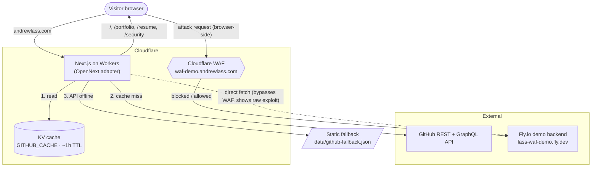

# lass-resume-online

[](https://github.com/bdsys/lass-resume-online/actions/workflows/quality.yml)
[](https://github.com/bdsys/lass-resume-online/actions/workflows/waf.yml)
[](https://github.com/bdsys/lass-resume-online/actions/workflows/infra.yml)
[](https://github.com/bdsys/lass-resume-online/actions/workflows/e2e.yml)
[](https://github.com/bdsys/lass-resume-online/actions/workflows/deploy.yml)
[](#license)

Personal developer/security portfolio for Andrew Lass — Senior Cloud Security & Infrastructure Engineer.

**Live site:** https://andrewlass.com

---

## What's here

| Route        | Description                                                   | Phase |
|--------------|---------------------------------------------------------------|-------|
| `/`          | Bio/about from live GitHub API, terminal intro, skills        | 1 ✅   |
| `/portfolio` | GitHub repos via REST + GraphQL, KV-cached, topic-categorized | 2 ✅   |
| `/resume`    | Typeset resume from `content/resume.json` + PDF download      | 3 ✅   |
| `/security`  | Live WAF demo — Cloudflare WAF blocks attacks on a Fly.io app | 5 ✅   |

---

## Architecture



GitHub data is read KV cache → GitHub API → static fallback, in that order
(`src/lib/github.ts`). The WAF demo deliberately fires attacks two ways: a
server-side **direct** fetch to Fly (bypasses the WAF, shows the raw exploit) and
a **browser-side** fetch through `waf-demo.andrewlass.com` (hits the real
Cloudflare WAF edge — Worker subrequests to the same zone skip WAF rules by design).

---

## Tech stack

| Layer          | Choice                                           |
|----------------|--------------------------------------------------|
| Frontend       | Next.js 16 (App Router, TypeScript)              |
| Styling        | Tailwind CSS v4 + custom dark theme              |
| Hosting        | Cloudflare Workers via `@opennextjs/cloudflare`  |
| Caching        | Cloudflare KV (`GITHUB_CACHE` binding)           |
| WAF            | Cloudflare WAF custom rules (OpenTofu, `infra/`) |
| Demo backend   | Fly.io (isolated vulnerable Express container)   |
| Resume source  | `content/resume.yaml` → `src/data/resume.json`   |

---

## Development

```bash
npm install
npm run dev          # Next.js local dev server (localhost:3000)
npm run build        # Standard Next.js build
npm run build:worker # OpenNext Cloudflare build (.open-next/)
npm run preview      # Preview on local Workerd runtime
npm run deploy       # Deploy to Cloudflare Workers
```

Resume content is generated from YAML — run `make content-check` after every edit
to `content/resume.yaml` to validate and regenerate `src/data/resume.json`.

---

## First-time setup

### 1. Cloudflare account + Wrangler login

```bash
npx wrangler login
```

### 2. Create KV namespace for GitHub API cache

```bash
npx wrangler kv namespace create GITHUB_CACHE
# Copy the id from the output and paste it into wrangler.toml
```

Edit `wrangler.toml`:
```toml
[[kv_namespaces]]
binding = "GITHUB_CACHE"
id = "PASTE_YOUR_KV_ID_HERE"
```

### 3. GitHub token secret — required for pinned repos

The "Featured" section on `/portfolio` uses the GraphQL pinned-items query, which
**requires** a token. Without it that section is silently empty. The token also
raises REST rate limits.

```bash
npx wrangler secret put GITHUB_TOKEN
# Enter a fine-grained token with public repo read access
```

### 4. Custom domain

Add your domain to Cloudflare with DNS proxied (orange cloud). Domains are attached
to the Worker via `routes` in `wrangler.toml`:

```toml
[[routes]]
pattern = "andrewlass.com"
custom_domain = true
```

### 5. (Optional) Cloudflare Web Analytics

Cookieless analytics. Create a site token in the Cloudflare dashboard → Web
Analytics, then expose it as `NEXT_PUBLIC_CF_BEACON_TOKEN` (e.g. a `wrangler`
var). The beacon is a no-op when the variable is unset.

---

## Deployment

Deploys are **automated**: pushing to `main` (typically by merging `dev → main`) runs the
`deploy.yml` workflow, which gates on lint/typecheck/unit tests and then builds and deploys the
Worker. You can also trigger it manually from the Actions tab (**Deploy → Run workflow**).

First-time setup requires two GitHub repo secrets (Settings → Secrets and variables → Actions):

| Secret                  | Value                                                              |
|-------------------------|-------------------------------------------------------------------|
| `CLOUDFLARE_API_TOKEN`  | API token from the "Edit Cloudflare Workers" template, scoped to the account + `andrewlass.com` zone |
| `CLOUDFLARE_ACCOUNT_ID` | Account id (`npx wrangler whoami`)                                 |

Manual deploy from a workstation still works as a fallback:

```bash
npm run build:worker   # Build with OpenNext Cloudflare adapter
npm run deploy         # Deploy the built worker to Cloudflare
```

### CI

GitHub Actions runs four test workflows on every push/PR to `main` and `dev`, plus a deploy
workflow on `main`. Each has its own status badge above:

| Workflow      | Trigger                | What it does                                       |
|---------------|------------------------|----------------------------------------------------|
| `quality.yml` | push/PR `main`, `dev`  | lint · typecheck · Vitest unit tests               |
| `waf.yml`     | push/PR `main`, `dev`  | waf-demo-app typecheck · unit tests · Docker smoke  |
| `infra.yml`   | push/PR `main`, `dev`  | OpenTofu `fmt -check` + `validate` (no backend)     |
| `e2e.yml`     | push/PR `main`, `dev`  | Playwright end-to-end tests (ubuntu-22.04)          |
| `deploy.yml`  | push `main` / manual   | quality gate → build worker → deploy to Cloudflare  |

---

## WAF demo setup (Phase 4–5)

See `docs/waf-isolation.md` for the full isolation architecture and deployment instructions.

**Live demo backend:** https://lass-waf-demo.fly.dev — proxied through Cloudflare WAF
at `waf-demo.andrewlass.com`.

---

## Repository structure

```
assets/          # Resume source .md files + achievement report
content/         # Site content source of truth (resume.yaml)
data/            # Static fallbacks (github-fallback.json)
docs/            # Architecture decisions, topic schema, deployment, WAF isolation
src/app/         # Next.js App Router (pages + /api routes)
src/components/  # Shared UI components
src/lib/         # GitHub API client, utilities
public/          # Static assets (PDF resume, llms.txt)
waf-demo-app/    # Isolated vulnerable backend (Phase 4)
infra/           # Cloudflare WAF rules as OpenTofu (Phase 5)
wrangler.toml    # Cloudflare Workers config
open-next.config.ts
```

---

## License

MIT
